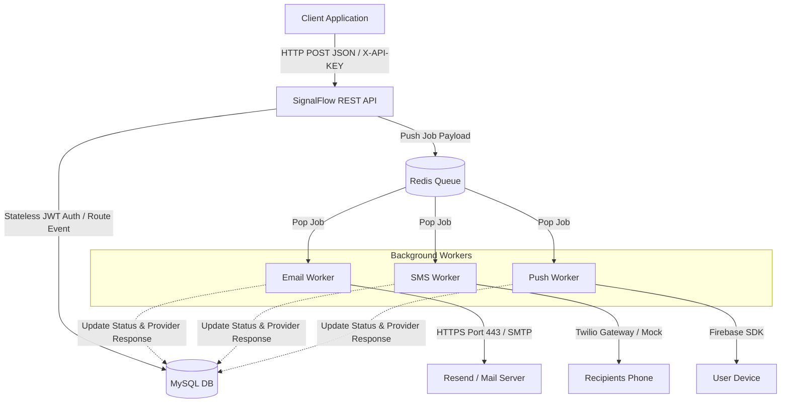

# SignalFlow

SignalFlow is a self-hosted, high-performance notification engine designed to centralize and automate multi-channel messaging. It abstracts email, SMS, and push notification delivery into a unified REST API, backed by a robust administrative dashboard.

Built using Spring Boot, React, and Redis, the engine handles heavy message loads asynchronously, featuring dynamic templating, automated retries with progressive backoff, and full delivery audit trails.

---

## Key Features

* **Multi-Channel Delivery**:
  * **Email**: Delivery via traditional SMTP or the Resend HTTP API (optimized for bypassing port restrictions on cloud hosting services like Render).
  * **SMS**: Outbound texts routed through Twilio, featuring an automatic local Mock Mode fallback when credentials are omitted.
  * **Push Notifications**: Mobile and web targets powered by Firebase Cloud Messaging (FCM).
* **Asynchronous Queue Pipeline**: Powered by Redis for priority job queuing and scheduled background worker processing, keeping internal request latency below 50ms.
* **Auto-Retries with Exponential Backoff**: Automatic handling of temporary provider failures, tracking jobs through comprehensive status transitions (Pending, Processing, Sent, Retrying, Dead).
* **Dynamic HTML Templating**: Render dynamic emails and notifications using the server-side FreeMarker engine, supporting custom logo and primary branding injection per client.
* **Developer Dashboard**: A premium, responsive interface featuring real-time analytics charts, searchable audit logs, template editors, and built-in delivery testing tools.

---

## System Architecture



---

## Configuration & Environment Settings

The engine uses a local `.env` file (ignored by Git) for local execution, while production credentials must be set within your cloud environment variables.

| Variable Category | Key | Description |
| :--- | :--- | :--- |
| **Database** | `SPRING_DATASOURCE_URL` | MySQL connection string (e.g., `jdbc:mysql://...`) |
| | `SPRING_DATASOURCE_USERNAME` | Database user |
| | `SPRING_DATASOURCE_PASSWORD` | Database password |
| **Redis** | `SPRING_DATA_REDIS_HOST` | Redis instance hostname |
| | `SPRING_DATA_REDIS_PORT` | Redis instance port (Default: `6379`) |
| **Security** | `JWT_SECRET` | Secret key used to sign and verify stateless user sessions |
| **Email SMTP** | `SPRING_MAIL_HOST` | Outbound SMTP mail server host |
| | `SPRING_MAIL_PORT` | Outbound SMTP port (e.g., `587`) |
| | `SPRING_MAIL_USERNAME` | SMTP account username |
| | `SPRING_MAIL_PASSWORD` | SMTP app password |
| **Resend HTTP API**| `RESEND_API_KEY` | Resend API Token (bypasses outbound SMTP port blocks) |
| | `RESEND_FROM_EMAIL` | Verified sender email domain on Resend |
| **Twilio SMS** | `TWILIO_ACCOUNT_SID` | Twilio Account Identification String |
| | `TWILIO_AUTH_TOKEN` | Twilio Authentication Token |
| | `TWILIO_FROM_NUMBER` | Registered Twilio virtual phone number |
| **Push FCM** | `FIREBASE_CREDENTIALS_PATH`| Absolute path to your Firebase admin SDK credentials JSON file |

---

## Getting Started

### 1. Prerequisite Infrastructure
Ensure Docker is installed and running, then spin up local MySQL and Redis instances using the included docker-compose file:
```bash
docker-compose up -d
```

### 2. Running the Backend (Spring Boot)
1. Copy `.env.example` to `.env` and fill in your local system properties:
   ```bash
   cp .env.example .env
   ```
2. Navigate to the backend directory and compile/run the application:
   ```bash
   cd backend
   mvn spring-boot:run
   ```

### 3. Running the Frontend (React Vite)
1. Navigate to the frontend directory:
   ```bash
   cd frontend
   ```
2. Install the package dependencies and launch the hot-reloading development server:
   ```bash
   npm install
   npm run dev
   ```

---

## REST API Integration Guide

Trigger multi-channel templates directly from your existing apps by making an authenticated HTTP request to the unified notification gateway.

### Endpoint
`POST /api/v1/notify`

### Headers
* `Content-Type: application/json`
* `X-API-KEY: <your-client-api-key>`

### Request Body (JSON)
```json
{
  "userId": "user_101",
  "event": "order_confirmed",
  "data": {
    "name": "Alex",
    "orderId": "ORD-8742",
    "total": "$149.99"
  }
}
```

### Integration Snippets

#### cURL
```bash
curl -X POST 'http://localhost:8080/api/v1/notify' \
  -H 'Content-Type: application/json' \
  -H 'X-API-KEY: your-client-api-key' \
  -d '{
    "userId": "user_101",
    "event": "order_confirmed",
    "data": {
      "name": "Alex",
      "orderId": "ORD-8742",
      "total": "$149.99"
    }
  }'
```

#### JavaScript / Node.js
```javascript
await fetch('http://localhost:8080/api/v1/notify', {
  method: 'POST',
  headers: {
    'Content-Type': 'application/json',
    'X-API-KEY': 'your-client-api-key'
  },
  body: JSON.stringify({
    userId: 'user_101',
    event: 'order_confirmed',
    data: {
      name: 'Alex',
      orderId: 'ORD-8742',
      total: '$149.99'
    }
  })
});
```

#### Python
```python
import requests

url = "http://localhost:8080/api/v1/notify"
headers = {
    "Content-Type": "application/json",
    "X-API-KEY": "your-client-api-key"
}
payload = {
    "userId": "user_101",
    "event": "order_confirmed",
    "data": {
        "name": "Alex",
        "orderId": "ORD-8742",
        "total": "$149.99"
    }
}

response = requests.post(url, headers=headers, json=payload)
```
